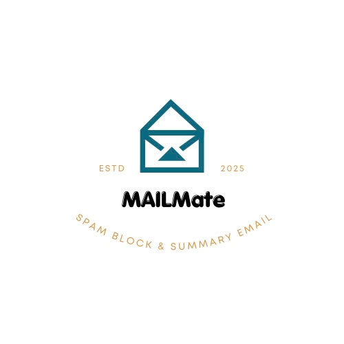

# MailMate - AI Browser Plugin for Email Management

 <!-- Replace with actual logo if available -->

**Date:** March 8, 2025  
**Author:** Tran Dinh Hung - Le Canh Trong  
**Grade:** 8th Grade EXE Project  
**Repository:** [[GitHub URL](https://github.com/HungTabe/MailMate_AIPlugin.git)] <!-- Replace with your repo URL -->

---

## Introduction

**Project Name:** MailMate - AI Browser Plugin for Automated Email Processing  
**Description:** MailMate is a browser plugin powered by artificial intelligence designed to streamline email management. It saves time and boosts productivity by:  
- Summarizing lengthy emails into concise, readable snippets.  
- Automatically filtering important emails while ignoring spam and advertisements.  
- Suggesting quick AI-generated replies.  
- Utilizing a backend to process Gmail data via the Gmail API.  

This project integrates cutting-edge AI technology with a user-friendly Chrome extension, making email handling smarter and more efficient.

---

## Features

- **Email Summarization:** Condenses long emails into short summaries using GPT-4.  
- **Email Classification:** Identifies and prioritizes important emails, marking spam or ads.  
- **Quick Replies:** Provides AI-suggested responses for faster communication.  
- **Gmail Integration:** Seamlessly connects to Gmail via the Gmail API with OAuth 2.0 authentication.

---

## Technology Stack

### Backend
- **Programming Language:** Node.js  
- **Framework:** Express.js  
- **APIs:**  
  - Gmail API (fetches email data from Gmail)  
  - OpenAI API (GPT-4 for summarization and reply suggestions)  
- **Database:** Optional (MongoDB or PostgreSQL)  
- **Authentication:** OAuth 2.0 (Google)  
- **Deployment:** Docker (deployable on AWS/GCP)

### Frontend
- **Programming Language:** JavaScript  
- **Framework:** React.js (optional)  
- **Technologies:** Chrome Extension API, WebSockets

---

## Project Structure
gmail-ai-plugin/
├── backend/                # Backend source code
│   ├── src/
│   │   ├── config/         # API configuration (e.g., OAuth setup)
│   │   ├── controllers/    # Business logic for email processing
│   │   ├── routes/         # API route definitions
│   │   └── app.js          # Server initialization
│   ├── Dockerfile          # Docker environment setup
│   └── docker-compose.yml  # Docker Compose configuration
├── frontend/               # Frontend source code
│   ├── public/             # Static assets
│   ├── src/                # React components (if used)
│   └── manifest.json       # Chrome Extension manifest
├── .env                    # Environment variables (API keys)
├── .gitignore              # Git ignore file
└── README.md               # Project documentation

## Prerequisites

### Tools
- **Node.js:** [Download](https://nodejs.org/)  
- **VS Code:** [Download](https://code.visualstudio.com/)  
- **Postman:** [Download](https://www.postman.com/downloads/)  
- **Docker:** [Download](https://www.docker.com/get-started)  

---

## Setup Instructions

### Backend Setup
1. **Clone the Repository:**
   ```bash
   git clone https://github.com/your-username/MailMate_AIPlugin_BE.git
   cd MailMate_AIPlugin_BE
   npm install express googleapis openai dotenv
   
2. **Configure Environment Variables**
Create a .env file in the root directory:

GOOGLE_CLIENT_ID=your_google_client_id
GOOGLE_CLIENT_SECRET=your_google_client_secret
REDIRECT_URI=http://localhost:3000/auth/google/callback
OPENAI_API_KEY=your_openai_api_key
PORT=3000

3. **Run the Server**
node src/app.js

## Conclusion
MailMate leverages AI (GPT-4) to revolutionize email management by automating summarization and classification. This project enhances productivity, allowing users to focus on critical emails while minimizing distractions from spam and ads. Future enhancements could include database integration for caching and advanced reply suggestions.

## License
This project is licensed under the MIT License - see the LICENSE file for details.

Contact: trandinhhung717@gmail.com | [\[Your GitHub Profile\]](https://github.com/HungTabe)
Happy coding! 


